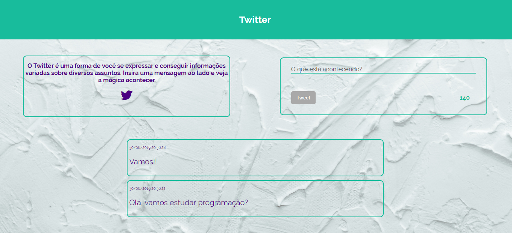

# Twitter

Projeto twitter para Laboratoria.

## Versão 0.0.6 (Hacker edition) ✔️
* Adicione a hora e a data em que o tweet foi publicado no formato de 24 horas hh:mm e data DD/MM/AA.

## Versão 0.0.5 (Hacker edition) ✔️
* Se o número de caracteres digitados (sem dar um "enter") exceder o tamanho da área de texto por padrão, mais uma linha deverá ser adicionada para que a rolagem não apareça. (Se aplicável)

## Versão 0.0.4 ✔️
* Ao pressionar enter (/n) aumente a área de texto de acordo com o tamanho do texto.

## Versão 0.0.3 ✔️
* Se você passar os 140 caracteres, desative o - botão;
* Se você passar os 120 caracteres, mostre o - contador com outra cor;
* Se você passar os 130 caracteres, mostre o - contador com outra cor;
* Se você passar os 140 caracteres, mostre o contador em negativo;

## Versão 0.0.2 ✔️
* Não inserir texto vazio (desativar o botão "twittar");
* Conte o número de caracteres de forma regressiva.

## Versão 0.0.1 ✔️
* Crie um formulário que permita inserir um texto e um botão para "twittar" (postar uma mensagem);
* Adicione um evento de click ao botão ou de submit no formulário;
* No evento, obter o texto. Adicione o texto ao HTML.